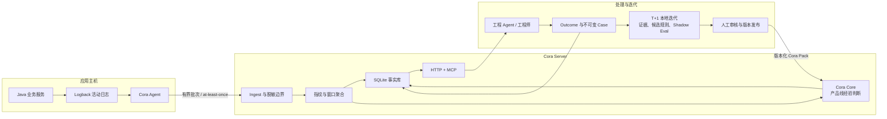

# Cora 产品与架构介绍

## 一句话介绍

Cora 是一套轻量、自托管、Agent First 的错误关注系统：它从现有应用日志中采集 ERROR，先把重复错误洪流压缩成稳定的 Problem，再结合产品线经验做可解释判断，并把 Agent 或工程师的处理结果沉淀为可复用 case，让系统下一次判断得更准。

Cora 不试图替代 Sentry、APM、日志平台或告警平台。它专注于这些系统之后仍然没有解决好的一个问题：

> 在大量重复、已知和缺少上下文的错误中，哪些问题现在值得看，为什么值得看，处理之后如何不再从头判断？

## 1. 我们为什么做 Cora

许多中小型研发团队并不缺日志，缺的是持续处理日志的注意力。

一个典型 Java 系统每天可能产生大量 ERROR，其中混杂着已知业务失败、第三方波动、用户输入错误、包装层异常和真正需要修复的系统问题。传统方案可以完成采集、检索、展示和告警，但团队仍要反复回答四个问题：

1. 这是一批新问题，还是同一个问题的重复爆发？
2. 这是业务噪音、待观察信号，还是需要立即关注的真实故障？
3. 它在什么服务、节点和调用链上发生，最近是否扩散或复发？
4. 上次是谁处理的、结论是什么，这次能否直接复用？

Cora 的设计目标不是“收集更多”，而是用更低的接入和运维成本，把已有错误事实转化为一条可持续的处理闭环：

```text
错误发生 → 去重聚合 → 判断关注级别 → Agent 调查处理
        → 记录 outcome/case → 复用经验 → 规则迭代
```

## 2. Cora 的核心价值

### 2.1 把错误数量变成可处理的问题数量

Cora 以 `product_line + service + fingerprint` 识别 Problem，在短窗口内聚合重复事件，只保留累计次数、趋势、节点分布和首尾代表样本。即使一个错误重复数百次，处理入口仍然是一个 Problem，而不是数百条日志。

这直接降低了工程师和 Agent 的阅读成本，也避免因为告警洪峰而忽略真正的新问题。

### 2.2 用产品线经验做可解释判断

Cora Core 对 Problem 给出三态决策：

- `attention`：值得优先调查；
- `observe`：证据不足或需要继续观察；
- `ignore`：已确认的稳定噪音，但事实仍然保留。

每次判断都记录命中的规则、原因、经验包版本和决策时间。未知问题默认进入 `observe`，Core 异常也不会阻断事实写入。这使 Cora 的判断可以审核、复现和回滚，而不是一个不可解释的黑盒分数。

### 2.3 把一次处理变成下一次可复用的经验

Agent 通过 MCP 获取待关注问题、查看上下文，并回写四类核心结果：是否真实问题、是否已经处理、根因和动作。Cora 将其保存为不可变 case；同类问题再次出现时，历史结论可以直接参与调查。

因此 Cora 的长期价值不只来自当前规则，而来自团队处理经验的持续结构化。一次有效处理不再只存在于聊天记录、个人记忆或工单描述里。

### 2.4 以很低的基础设施成本落地

Cora 当前采用 Go 静态二进制、单 Server、SQLite WAL 和每台应用主机一个 Agent，不依赖 MQ、Redis、Elasticsearch 或独立 Web 控制台。业务服务不需要引入 SDK，也不需要配合发版；Agent 直接跟随现有 Logback 文件。

这使它适合已有日志、运维资源有限、又希望引入 Agent 自动调查能力的团队。

### 2.5 为 Agent 提供事实接口，而不是再做一个人肉看板

Cora 的主要消费界面是 MCP。Agent 可以在同一个协议里完成“发现—调查—回写—复查”，而不是让人先登录控制台、复制日志，再把上下文手工交给 AI。

Web UI 和通知渠道可以后置；结构化、受约束、可回写的事实接口必须先完成。

## 3. 总体架构



架构上可以理解为五层：

| 层次 | 组件 | 责任边界 |
| --- | --- | --- |
| 采集层 | Cora Agent | 跟随多个日志文件、重建多行异常、附加有限前文、脱敏、可靠续传 |
| 事实层 | Cora Server | 接收、指纹、聚合、保存 Problem、趋势、节点事实和代表样本 |
| 判断层 | Cora Core | 基于显式产品线经验给出 `attention / observe / ignore` |
| 协作层 | HTTP + MCP | 向 Agent 提供查询、调查、结果回写和 case 导出能力 |
| 迭代层 | `cora-iterate` + Cora Pack | 冻结证据、生成候选、影子评估、人工审核后发布 |

## 4. 关键设计取舍

### 4.1 先压缩，再判断

原始错误洪流不直接进入 LLM，也不直接暴露给 Agent。Cora 先用确定性指纹和窗口聚合形成 Problem，再对 Problem 做判断。这样既控制上下文成本，也避免重复事件反复消耗人和模型的注意力。

### 4.2 事实与判断分离

Server 负责保存事实，Core 负责给出判断。Core 失败时，Server 仍保存 Problem，并用保守的 `observe` 作为框架默认值。`ignore` 也只影响当前关注队列，不会删除事实。

这个边界保证“判断可以演进，事实不能因判断失败而丢失”。未来 Core 可以独立进程化或引入 LLM，而不需要重写采集和事实层。

### 4.3 产品线是强隔离边界

所有查询、规则、case 和迭代产物都显式绑定 `product_line`。一条产品线的经验不会默认应用到另一条产品线；未训练产品线采用保守策略。

这是 Cora 从第一天就保留的治理约束，因为错误文本相似不等于业务语义相同。

### 4.4 读取面可以归组，事实面不做过度合并

同一 trace 上的多个 Problem 可以在注意力列表中归为一个 incident，减少包装层异常造成的重复调查；底层 Problem、状态、计数和 case 仍然分开保存。

这样既能给 Agent 一个合理的调查入口，又不会为了界面简洁而破坏服务边界和原始事实。

### 4.5 自我迭代不等于生产自动学习

Cora 的迭代路径是：规则处理稳定快路径，Agent 记录真实结果，重复且一致的 case 形成候选规则，候选经过冻结数据集上的 shadow evaluation 和人工审核后才能发布。

当前不会让生产结果自动训练并激活新规则。LLM 灰区判断、case top-k 检索和统计模型只有在数据完整性、样本量和评估集达到门槛后才进入。这是为了防止错误经验被快速放大。

### 4.6 SQLite 是有意选择，不是临时凑合

Cora 的生产数据库被定义为热工作集，而不是永久日志仓库。SQLite 保存当前 Problem、计数、趋势、代表样本、决策和近期 case；长期审计事实通过不可变导出、哈希清单、规则版本和 closure receipt 保存。

在当前“单公司内网、少量主机、best-effort 关注发现”的边界内，SQLite 显著降低了部署、备份和故障恢复复杂度。只有当真实负载证明单机边界成为瓶颈时，才值得引入更重的基础设施。

## 5. 一次错误如何完成闭环

1. **采集**：Agent 从现有 Logback 活动文件读取 ERROR，重建 Java 多行堆栈，并用 trace 或 thread 附加有界前文。
2. **保护**：上传前脱敏凭据、签名 URL、手机号和身份号码；批次受事件数和字节数双重限制。
3. **确认交付**：只有 Server 返回 2xx，Agent 才提交文件位置；失败时重试，最终失败后退出并由 Supervisor 拉起。
4. **形成 Problem**：Server 计算稳定指纹，在内存窗口内聚合，并把服务、节点、趋势和代表样本写入 SQLite。
5. **做出判断**：Core 根据该产品线的版本化 Cora Pack 给出三态决策与可解释原因。
6. **Agent 调查**：Agent 通过 MCP 获取当前 attention incident、Problem 详情、相关服务、趋势、样本和历史 case。
7. **记录结果**：Agent 或工程师回写真实问题、处理状态、根因和动作；Problem 进入 `acknowledged / resolved`，新事件可以使其变为 `recurring`。
8. **沉淀经验**：不可变 case 进入 T+1 迭代；有足够一致证据时生成候选规则，经过 shadow evaluation、审核和发布后进入下一版 Pack。

## 6. Agent First 接口

Cora Server 在同一进程中提供受 bearer token 保护的 Streamable HTTP MCP：

| MCP 工具 | 作用 |
| --- | --- |
| `cora_list_attention` | 获取一个产品线当前值得关注的 incident/Problem |
| `cora_get_problem` | 查看样本、趋势、节点、相关 Problem 和历史 case |
| `cora_record_outcome` | 回写调查结论并生成不可变 case |
| `cora_export_cases` | 冻结并分页导出可校验的 case snapshot |
| `cora_iteration_snapshot` | 获取指定业务窗口的只读迭代事实 |
| `cora_retention_audit` | 在线只读检查生命周期阻断项，并筛出可进入离线法证审计的问题 |

这些工具都要求显式产品线；Problem 级工具还要求显式服务和指纹。case 导出冻结 high-water case ID，并为每页提供内容哈希，保证本地迭代可以复现同一份输入。在线 retention audit 不读取本地 closure receipt 或 artifact，因此只报告生产热库前置条件，不能授权清理；真正清理前仍须对一致性备份运行离线法证审计。

## 7. 当前实现与验证状态

截至 2026-07-15，仓库中的真实能力包括：

- Go 静态二进制 Agent/Server、单 Server、SQLite WAL、Supervisor 部署与备份恢复脚本；
- 多文件 Logback 采集、多行堆栈、trace/thread 前文、上传前脱敏和可靠位置提交；
- 确定性指纹、窗口聚合、趋势、节点分布、Problem 生命周期和复发语义；
- 受认证的 HTTP/MCP 闭环与稳定 case 导出；
- 首个内部产品线经验包，共 131 条经过审阅的规则；
- 1,404 行历史数据的可复现 shadow evaluation：决定性覆盖率 60.2%，决定性样本一致率 99.3%；同时明确识别出时间戳、异常堆栈和指纹多样性不足，因而没有据此启用统计模型；
- 真实业务拓扑中的 Cora Server，以及两个业务节点的 Agent 接入；
- 只读 T+1 规则迭代工作流，可冻结 case、汇总业务日事实、接入独立代码证据、生成候选和影子评估产物，但不会自动修改生产规则。
- 只读在线 retention MCP 预检，以及对一致性备份执行的离线 B0 法证审计；两者都不会执行清理。

当前尚未实现或尚未完成验证的能力：

- LLM 灰区判断与 Core 内部 case top-k 检索；
- event ID 级幂等去重；
- 自动候选规则晋升、在线自训练或自动生产激活；
- Web UI、通知渠道、HA 集群和完整 APM 能力；
- 生产事实压缩/清理执行器；目前只有生命周期 ADR，任何清理都应先经过只读 retention audit、closure receipt 和恢复演练。

这一区分很重要：Cora 已经具备“采集—聚合—判断—Agent 回写—case 导出”的最小闭环，但仍处于通过真实运行验证价值和校准边界的阶段。

## 8. 我们如何衡量价值

Cora 不以“采集了多少日志”作为主要成功指标。更适合关注的指标是：

| 维度 | 建议指标 |
| --- | --- |
| 发现价值 | 每周期发现并确认的原本可能被忽略的真实问题数 |
| 处理效率 | 从 Problem 首次出现到形成可信 outcome 的时间 |
| 注意力压缩 | 原始 ERROR 数量与实际调查 Problem 数量的压缩比 |
| 经验复用 | 复发问题命中既有 case、规则或处理动作的比例 |
| 判断质量 | attention 真问题率、ignore 抽检误伤率、observe 收敛率 |
| 运行可靠性 | 静默停止采集、跨产品线混用、不可恢复写入失败的次数 |
| 总拥有成本 | 部署节点、日常运维时间、存储增长和 Agent/模型调用成本 |

第一阶段最有意义的验收并不是覆盖全部问题，而是：以可接受的运行成本，稳定发现并闭环至少一个过去容易被忽略的真实问题，并让下一次同类处理明显更快。

## 9. 与常见方案的关系

| 方案 | 最擅长的事情 | Cora 的关系 |
| --- | --- | --- |
| 日志平台 | 收集、检索和长期保存原始日志 | Cora 消费现有活动日志，不替代原始日志事实源 |
| Sentry / APM | 全面错误追踪、性能观测、生态集成和可视化 | Cora 不追求完整观测面，聚焦轻量错误关注和经验闭环 |
| 告警平台 | 基于指标或规则及时通知人 | Cora 先形成可解释 Problem；通知属于可选下游 |
| 通用 AI Agent | 阅读上下文、推理和执行调查 | Cora 为 Agent 提供压缩、隔离、可追溯且可回写的运行事实 |
| 知识库 / 工单 | 保存人工结论和协作记录 | Cora 把结论绑定到具体产品线、服务、指纹和运行快照 |

Cora 更像是位于“日志事实”和“工程 Agent”之间的错误判断与经验层。

## 10. 推荐落地路径

对于一个新团队，建议采用四步验证，而不是一次性全量接入：

1. **72 小时受控 canary**：部署一个 Server、一个 Agent，只跟随 1–2 个明确日志文件，从文件末尾开始，验证脱敏、积压、重试、备份和恢复。
2. **完成一个真实闭环**：由 Agent 调用 list/get，调查一个问题，回写 outcome，并确认 resolved/recurring 与 case 再读取正常。
3. **建立产品线经验基线**：审阅第一批 attention/observe/ignore 规则，用冻结数据做 shadow evaluation，不追求一开始就自动学习。
4. **按价值扩展**：只有当发现价值和运维成本被证明后，再扩服务、加 case 检索、LLM 灰区判断或更强存储。

每一步都有明确退出条件。若持续积压、敏感数据泄露、产品线事实混用、备份无法恢复，或一直没有发现可闭环的问题，就应暂停扩张并修正设计。

## 11. 常见问题

### 这是不是重复建设一个监控平台？

不是。Cora 有意放弃全量日志检索、完整 tracing、性能指标、告警渠道和大而全的 UI，把工程投入集中在“错误压缩、产品线判断、Agent 闭环和经验复用”上。它可以建立在现有日志体系旁边，而不是要求替换现有基础设施。

### 为什么现在不用 LLM 直接看日志？

原始日志重复度高、上下文成本高、敏感信息多，而且没有稳定反馈就无法评估判断质量。Cora 先建立确定性事实层、可解释规则层和 outcome/case 闭环；LLM 只处理规则无法覆盖的灰区，并且必须基于同产品线事实和可回溯 case。

### 单机 SQLite 能否长期支撑？

在当前产品边界内可以，而且更符合成本目标。Cora 保存的是折叠后的热工作集，不是全量日志。趋势、样本和 case 的增长需要通过可审核的生命周期管理控制。若未来真实负载、并发或可用性目标越过单机边界，事实层接口和 Core 接口都已为后续替换保留边界，但我们不会在证据出现之前预付分布式复杂度。

## 结语

Cora 的价值不在于再展示一批错误，而在于把团队有限的工程注意力放到更可能有价值的问题上，并让每一次真实处理成为下一次判断的起点。

它选择了一条克制的技术路线：不侵入业务、先压缩事实、判断可解释、产品线隔离、Agent 原生、经验可审计。对希望用 AI 提升工程效率、但不愿先承担一套重型观测平台成本的团队，这是一条可以从很小范围开始、用真实结果逐步证明的路径。
